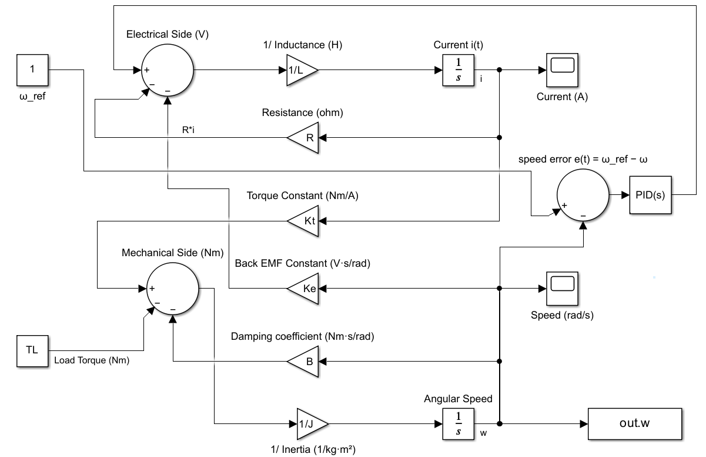

# DC Motor Dynamic Modeling & PID Speed Control using MATLAB Simulink


## Project Overview 

This project models the electromechanical dynamics of a DC motor using MATLAB Simulink, designs a PID controller for speed regulation, and compares numerical solvers (`ode45` vs `ode15s`) using quantitative response metrics.

---

## 1. Objective

* Build a physics-based model of a DC motor.
* Validate open-loop behavior using RL + rotational dynamics.
* Implement a PID controller for speed regulation.
* Tune gains manually for smooth and stable tracking.
* Compare solver performance and analyze step response metrics.

---

## 2. Mathematical Model

The system is defined by two coupled differential equations representing the electrical and mechanical domains.

### Electrical Model (Kirchhoff's Voltage Law)
$$L \frac{di}{dt} = V - Ri - K_e \omega$$

### Mechanical Model (Newton's 2nd Law)
$$J \frac{d\omega}{dt} = K_t i - B\omega - T_L$$

### Variable Definitions

| Symbol | Meaning | Unit |
| :---: | :--- | :--- |
| $i$ | Armature current | A |
| $\omega$ | Angular speed | rad/s |
| $L$ | Armature Inductance | H |
| $R$ | Armature Resistance | $\Omega$ |
| $K_e$ | Back EMF Constant | V/(rad/s) |
| $K_t$ | Torque Constant | Nm/A |
| $J$ | Rotor Inertia | kg·m² |
| $B$ | Viscous Damping Coeff. | Nms |
| $T_L$ | Load Torque | Nm |

### System Parameters

R  = 1;      % Ohm
L  = 0.5;    % H
Ke = 0.01;   % V/(rad/s)
Kt = 0.01;   % Nm/A
J  = 0.01;   % kg*m^2
B  = 0.1;    % Nms
TL = 0.1;    % Nm
V  = 12;     % V

## 3. Simulink Model Overview 



The Simulink model consists of:
1. Electrical Subsystem: Converts applied voltage ($V$) to current ($i$).
2. Mechanical Subsystem: Converts torque (from current) to speed ($\omega$).
3. Feedback Loop: Compares reference speed to actual speed to drive the PID controller.
4. Workspace Logging: Exports data for solver and performance analysis.

## 4. Open-Loop Results

Key observations from the open-loop simulation without a controller

Current $i(t)$: Rises exponentially to approx 12 A ($V/R$).
Angular Speed: Stabilizes around 0.2 rad/s under load.
Verification: Behavior matches theoretical steady-state calculations.🎛 

## 5. PID Controller Design

Manual tuning was performed to reduce overshoot and achieve smooth settling.

❌ Initial Gains

Values: $P = 10, I = 50, D = 0
Result: Very high overshoot (~80%) with significant oscillations.

⚠️ Improved Attempt

Values: $P = 6, I = 40, D = 0.1
Result: Reduced oscillations but still unstable.

✅ Final Tuned Gains

Values: $P = 5, I = 12, D = 0.2
Result: 
Smooth rise to reference.
Near-zero overshoot.
Fast settling time.
Good stability under load torque.

## 6. Solver Comparison (ode45 vs ode15s)

Step response metrics were extracted using the stepinfo() command in MATLAB.

| Metric | ode45 (Non-stiff) | ode15s (Stiff) |
| :--- | :--- | :--- |
| **Rise Time** | 1.3031 s | 1.3687 s |
| **Settling Time** | 2.6784 s | 2.8976 s |
| **Overshoot** | 0 % | 0.12 % |
| **Peak Time** | 3.0 s | 4.2058 s |

Interpretation:
ode45: Faster rise time, efficient for smooth systems.
ode15s: Slightly slower but smoother response.
Conclusion: Both solvers are stable and appropriate for this specific DC motor model.

## 7. Conclusions

The DC motor model accurately reflects electromechanical dynamics.
PID control significantly improves speed tracking performance compared to open-loop.
Final tuned gains ($P=5, I=12, D=0.2$) provide a stable, smooth, overshoot-free response.Closed-loop behavior demonstrates robust control against disturbances.

## 8. Future Scope

[ ] Implement Anti-windup PID.
[ ] Test disturbance rejection (step change in load torque).
[ ] Create State-space model of the motor.
[ ] Implement advanced controllers (LQR, MPC).
[ ] Model nonlinearities (saturation, dead-zone, friction).
[ ] Hardware validation using Arduino + DC motor driver.

## 📂 9. Repository Contents

```text
/MOTOR PROJECT
│── slprj/                   # Simulink project cache files
│── DC_Motor_Model.slx       # Main Simulink model
│── DC_Motor_Model.slxc      # Simulink cache file
│── DC_Motor_PID_Report.pdf  # Detailed project report
│── Matlab_model.png         # Screenshot of the Simulink model
│── motor_parameters.m       # MATLAB script for system parameters
│── README.md                # Project documentation